# ANSIBLE REFACTORING AND STATIC ASSIGNMENTS (IMPORTS AND ROLES)

The purpose of this project is to continue working with ansible-config-mgt repository and make some improvements to our code. we need to refactor our Ansible code, create assignments, and use the imports functionality. Imports allow to effectively re-use previously created playbooks in a new playbook – it allows you to organize your tasks and reuse them when needed.

## Jenkins Job Enhancement

Before Proceeding, changes needs to be made to our Jenkins job. Reason is that for every new change in the codes creates a separate directory which is not very convenient when we want to run some commands from one place. Besides, it consumes space on Jenkins servers with each subsequent change. Let us enhance it by introducing a new Jenkins project/job.

- From Jenkins-Ansible server created a new directory called ansible-config-artifact – this is where all artifacts will be stored after each build.

```
sudo mkdir /home/ubuntu/ansible-config-artifact
```

- Changed permissions to this directory, so Jenkins could save files there 

```
chmod -R 0777 /home/ubuntu/ansible-config-artifact
```

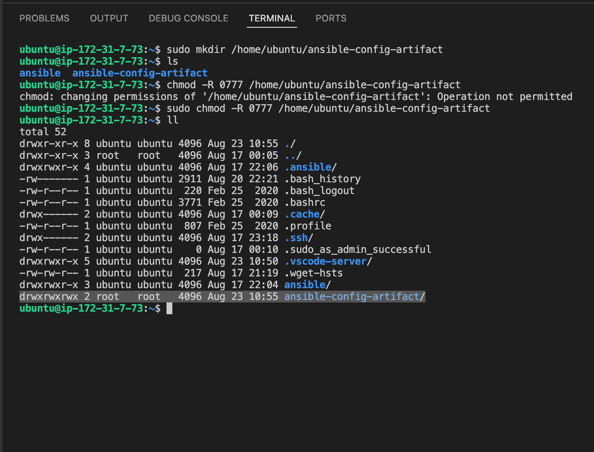

- From Jenkins web console -> Manage Jenkins -> Manage Plugins -> on Available tab, searched for Copy Artifact and installed the plugin without restarting Jenkins.

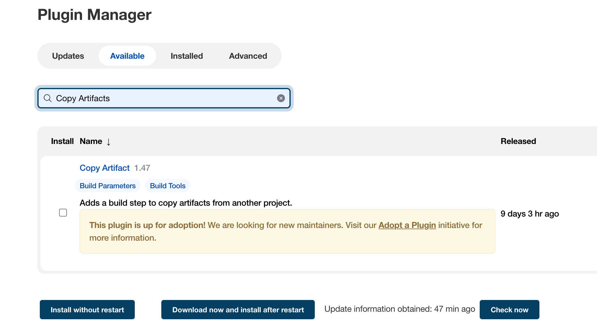

- Created a new Freestyle project and named it save_artifacts.

-  This project will be triggered by completion of the existing ansible project. Configured accordingly

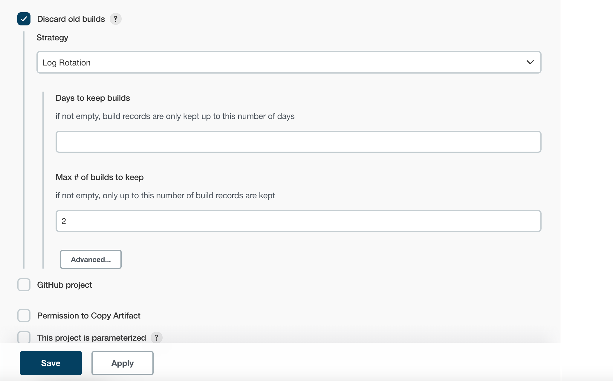
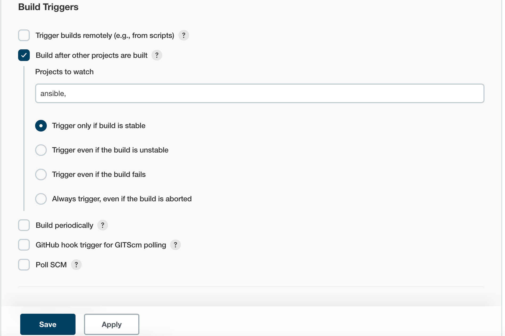

- The main idea of save_artifacts project is to save artifacts into /home/ubuntu/ansible-config-artifact directory. To achieve this, created a Build step and choose Copy artifacts from other project, specified ansible as a source project and /home/ubuntu/ansible-config-artifact as a target directory.

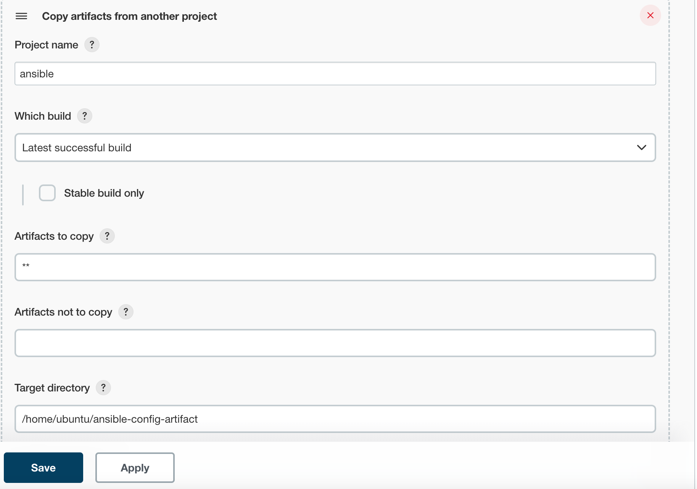

- Tested the set up by making some change in README.MD file inside my ansible-config repository (right inside main branch).

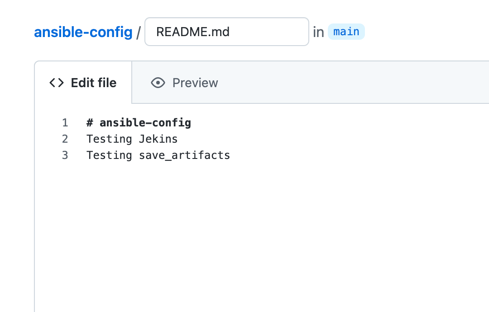

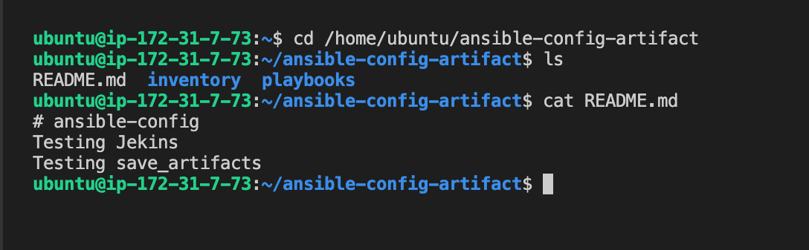

## REFACTOR ANSIBLE CODE BY IMPORTING OTHER PLAYBOOKS INTO SITE.YML


- Before starting to refactor the codes, made sure the latest code from master (main) branch was pulled, then created a new branch, name it refactor.

- Within playbooks folder, created a new file and named it site.yml, this file will now be considered as an entry point into the entire infrastructure configuration. The site.yml will become a parent to all other playbooks that will be developed.

- Created a new folder in root of the directory and named it static-assignment. The static-assignments folder is where all other children playbooks will be stored. This is merely for easy organization of  our work. It is not an Ansible specific concept, therefore we can arrange it as we deem fit.

- Moved common.yml file into the newly created static-assignments folder. The commands used for the process can be seen in the image below;

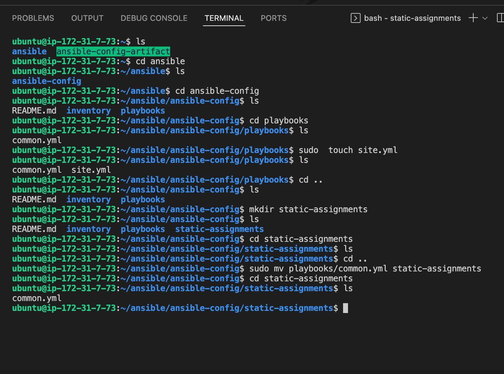

- Inside site.yml file, import common.yml playbook.

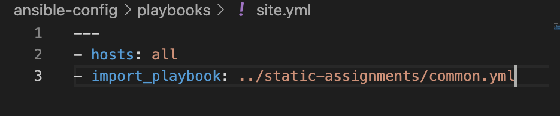

- The folder structure should look like this:

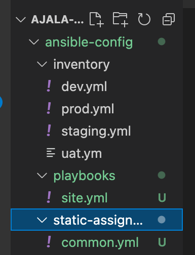

- Created another playbook under static-assignments and named it common-del.yml. In this playbook, configure deletion of wireshark utility.

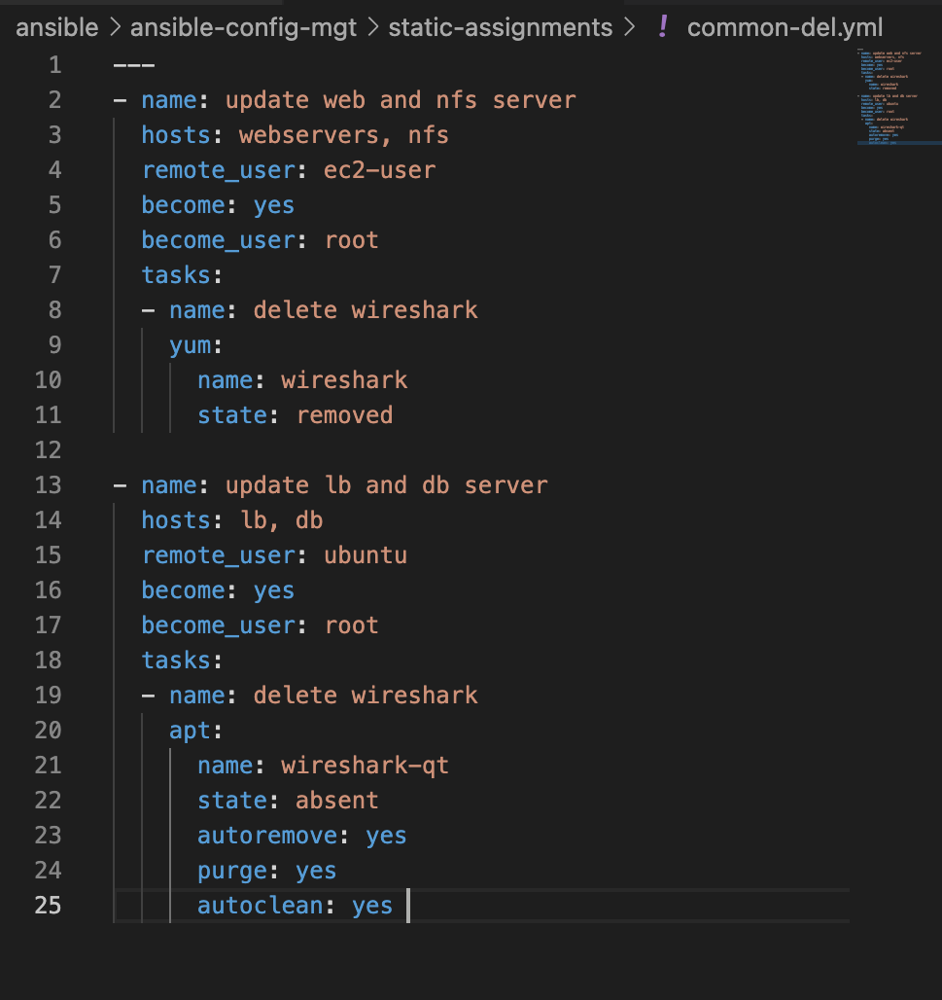

- Updated site.yml with import_playbook: ../static-assignments/common-del.yml and run against dev servers

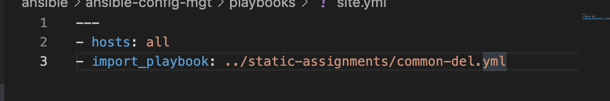

- ran ansible-playbook

```
ansible-playbook -i inventory/dev.yml playbooks/site.yaml
```
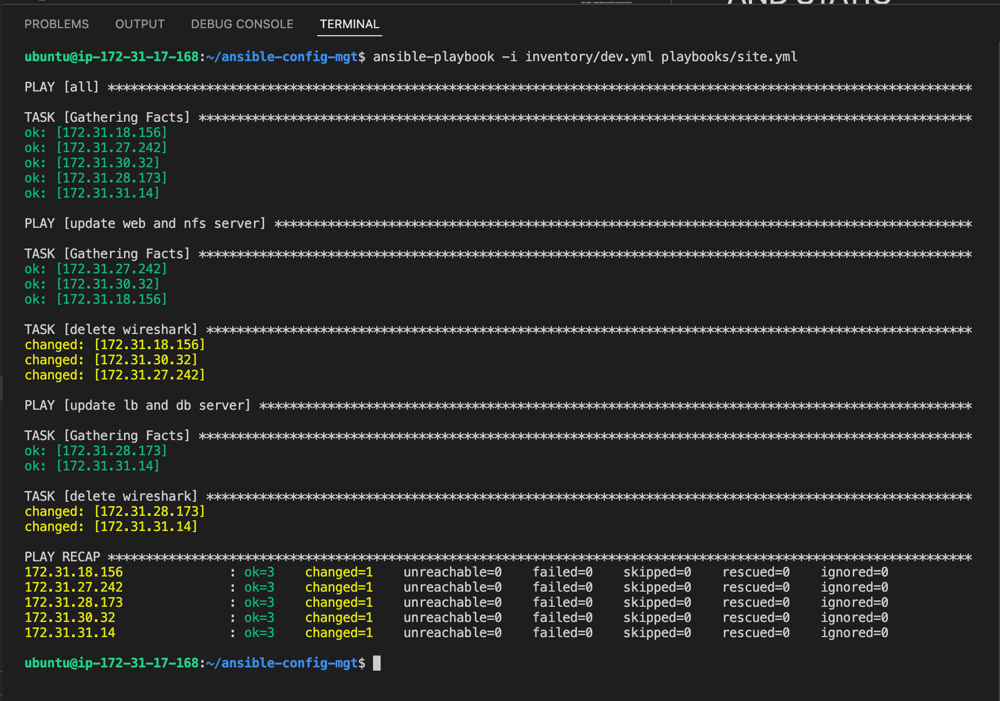


## Configure UAT Webservers with a role ‘Webserver’

- Launched 2 EC2 instances using RHEL 8 image, it was used for uat servers, named accordingly – Web1-UAT and Web2-UAT.

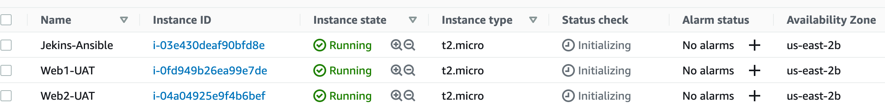

- Created a directory called role and Created the directory/files structure manually. the structure can be seen in the image below;

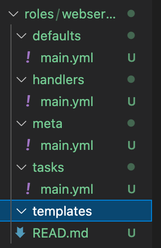

- Updated the inventory ansible-config-mgt/inventory/uat.yml file with IP addresses of the 2 UAT Webservers.

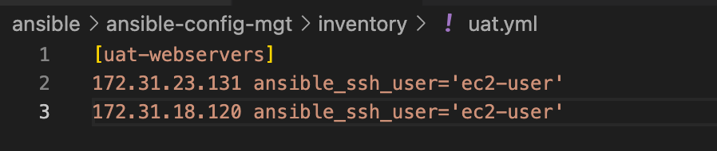

## Commit & Test

- Commit the changes and created a Pull Request and merge them to main branch hence, webhook triggered two consequent Jenkins jobs, they ran successfully and copied all the files to Jenkins-Ansible server into /home/ubuntu/ansible-config-mgt/ directory.

- ran the playbook against uat inventory

```
ansible-playbook -i /home/ubuntu/ansible-config-artifact/inventory/uat.yml /home/ubuntu/ansible-config-artifact/playbooks/site.yml
```

- The result is shown below;

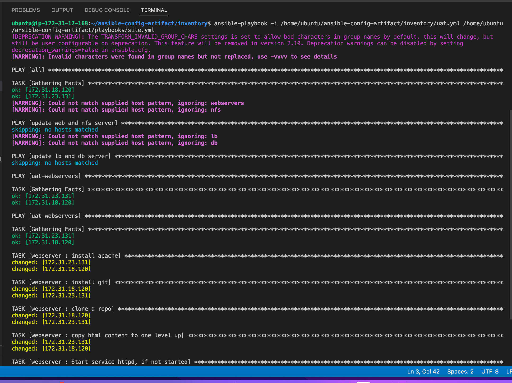
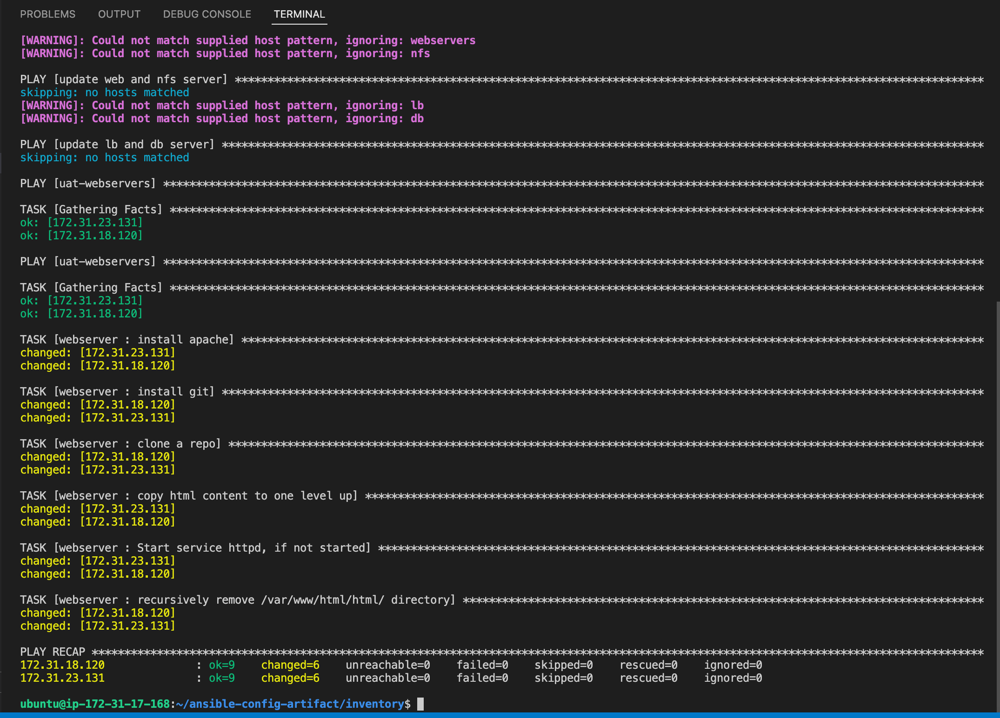

- Verified that the uat webserver was configured successfully by accessing the webserver public ip address


- Hence the Ansible architecture now looks like this:


### PROJECT COMPLETED


